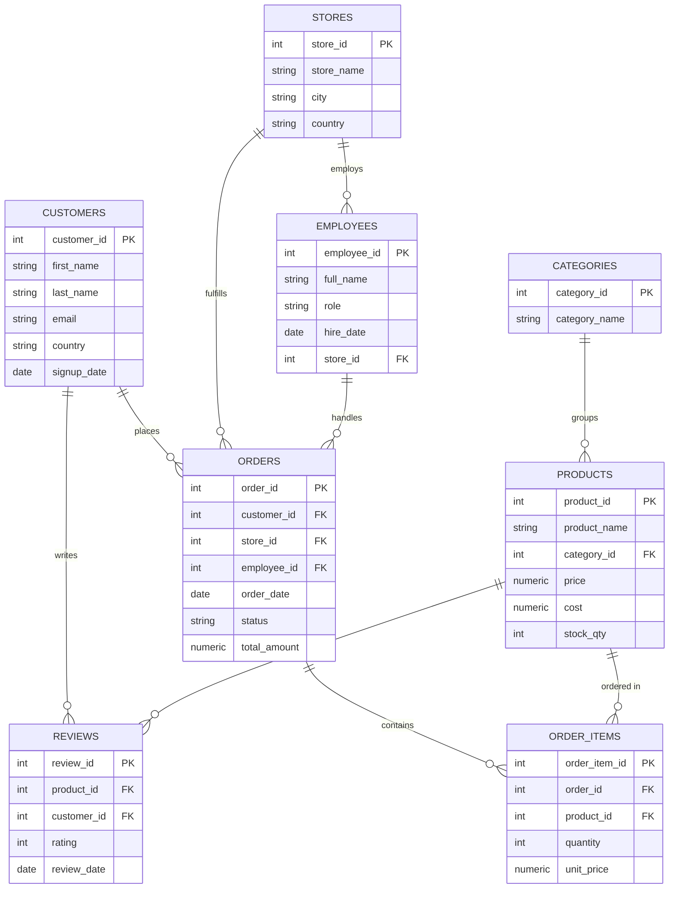

# RetailPulse — SQL Analytics Project for Retail Sales

A realistic multi-store retail/e-commerce database with a set of
analytical SQL queries modeled on real business reporting: schema
design, indexing, CTEs, window functions, views, and triggers.

## Why this project

Most beginner SQL portfolios show `SELECT * FROM table`. This one
is closer to what a data analyst actually delivers:

- **Schema design** — 8 normalized tables (customers, orders,
  order_items, products, categories, stores, employees, reviews)
  with foreign keys and indexes.
- **RFM customer segmentation** — Recency/Frequency/Monetary scoring
  with `NTILE()`, the technique marketing teams use to target
  retention campaigns.
- **Cohort retention analysis** — month-by-month retention, the
  report SaaS/e-commerce teams ask analysts for.
- **Window functions** — running totals, 7-day moving averages,
  `RANK()` per category, year-over-year growth with `LAG()`.
- **Views & triggers** — `customer_ltv` and `product_performance`
  views ready to plug into Metabase/PowerBI/Tableau, plus triggers
  that auto-update stock and order totals.

## Sample results

Real output from the included dataset (500 customers, ~2,600
completed orders):

**Store performance**

| Store | City | Orders | Revenue | AOV |
|---|---|---|---|---|
| Harbor Branch | Toronto | 539 | $574,367.86 | $1,065.62 |
| Online Warehouse | Berlin | 545 | $568,300.20 | $1,042.75 |
| Downtown Flagship | New York | 517 | $558,913.00 | $1,081.07 |
| Westside Outlet | Los Angeles | 521 | $549,539.06 | $1,054.78 |
| Central Store | London | 509 | $545,674.38 | $1,072.05 |

Total revenue across all stores: **$2,796,794.50**

**RFM customer segmentation**

| Segment | Customers | Revenue |
|---|---|---|
| At Risk (High Value) | 94 | $1,228,138.91 |
| Needs Attention | 104 | $791,927.35 |
| Champions | 24 | $274,457.89 |
| Loyal Customers | 35 | $206,708.53 |
| New / Promising | 97 | $202,821.96 |
| Lost / Churned | 38 | $92,739.86 |

94 customers flagged "At Risk (High Value)" account for **44% of
total revenue** — a direct, actionable retention target that the
raw orders table alone doesn't surface.

## Entity-relationship diagram



## Project structure

```
retail-analytics-sql/
├── schema.sql                 # table definitions + indexes
├── seed_data.py                # generates realistic synthetic data (no external deps)
├── views_and_triggers.sql      # reusable views + automation triggers
├── queries/
│   ├── 01_business_kpis.sql        # revenue, AOV, margin, store leaderboard
│   ├── 02_customer_segmentation.sql# RFM segmentation
│   ├── 03_cohort_retention.sql     # monthly cohort retention
│   └── 04_sales_trends.sql         # running totals, moving avg, rankings, YoY
└── retail.db                   # ready-to-use SQLite database (pre-generated)
```

## Quick start

Requires only `sqlite3` (and Python 3 if you want to regenerate
the data).

```bash
git clone https://github.com/serhiialekseichuk-design/retail-analytics-sql.git
cd retail-analytics-sql
sqlite3 retail.db < views_and_triggers.sql
sqlite3 retail.db < queries/01_business_kpis.sql
```

Or explore interactively:

```bash
sqlite3 retail.db
sqlite> .headers on
sqlite> .mode column
sqlite> .read queries/02_customer_segmentation.sql
```

To regenerate the dataset from scratch:

```bash
python seed_data.py
```

## Running on Android (Termux / Pydroid / Acode)

**Termux (recommended, fastest):**
```bash
pkg install sqlite python -y
cd retail-analytics-sql
python seed_data.py
sqlite3 retail.db < queries/02_customer_segmentation.sql
```

**Pydroid 3:** open `seed_data.py` and run it — it uses only the
standard library (`sqlite3`, `random`, `datetime`), so no pip
installs are needed. Then query `retail.db` from a short script:
```python
import sqlite3
conn = sqlite3.connect("retail.db")
for row in conn.execute(open("queries/01_business_kpis.sql").read().split(";")[0]):
    print(row)
```

**Acode:** use it purely as the editor for the `.sql` files and
`seed_data.py`; run everything through the Termux terminal (Acode
has a built-in Termux plugin for exactly this workflow).

## Extending it further

- Add a `discounts`/`promotions` table and a query measuring
  promo lift.
- Port `schema.sql` to PostgreSQL and add `EXPLAIN ANALYZE`
  query-optimization notes.
- Wire `customer_ltv` / `product_performance` views into a free
  BI tool (Metabase) for a live dashboard demo.
